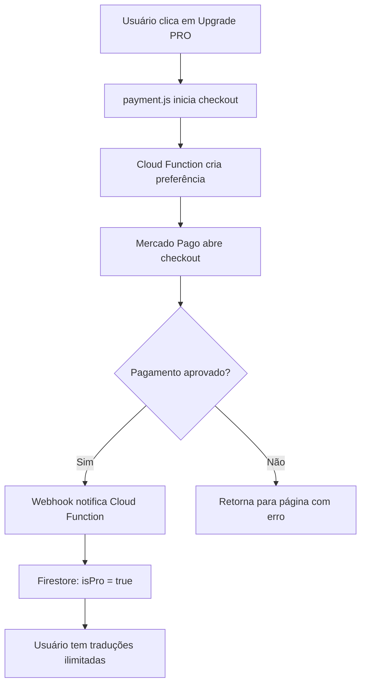

# 💳 Sistema de Pagamento - Plano PRO

Guia completo para implementar assinaturas mensais (R$ 19,90/mês) no Tradutor Profissional AI.

---

## 🎯 O Que Vamos Implementar

✅ Assinatura mensal recorrente (R$ 19,90/mês)
✅ Traduções ilimitadas para usuários PRO
✅ Integração com Mercado Pago (Brasil) ou Stripe (Global)
✅ Upgrade automático no Firebase
✅ Cancelamento de assinatura

---

## 📊 Comparação: Mercado Pago vs Stripe

### **Mercado Pago** (Recomendado para Brasil)
- ✅ **Melhor para público brasileiro**
- ✅ Aceita PIX, Boleto, Cartão
- ✅ Taxas: 4,99% + R$ 0,39 por transação
- ✅ Recorrência nativa
- ✅ Integração mais simples
- ❌ Foco apenas América Latina

### **Stripe** (Recomendado para Global)
- ✅ **Melhor para público internacional**
- ✅ Aceita cartões internacionais
- ✅ Taxas: 3,4% + R$ 0,40 por transação
- ✅ Recorrência muito robusta
- ✅ Dashboard profissional
- ❌ Requer mais configuração

---

## 🛠️ OPÇÃO 1: Mercado Pago (MAIS FÁCIL)

### Passo 1: Criar Conta Mercado Pago

1. Acesse [https://www.mercadopago.com.br/developers](https://www.mercadopago.com.br/developers)
2. Crie sua conta ou faça login
3. Vá em **"Suas integrações"** → **"Criar aplicação"**
4. Escolha **"Pagamentos online"**
5. Copie suas credenciais:
   - **Public Key** (começa com `APP_USR`)
   - **Access Token** (começa com `APP_USR`)

---

### Passo 2: Criar Plano de Assinatura

1. Acesse [https://www.mercadopago.com.br/subscriptions/plans](https://www.mercadopago.com.br/subscriptions/plans)
2. Clique em **"Criar plano"**
3. Preencha os dados:
   - **Nome:** Plano PRO - Tradutor AI
   - **Valor:** R$ 19,90
   - **Frequência:** Mensal
   - **Benefícios:** Traduções ilimitadas, sem anúncios, suporte prioritário
4. Clique em **"Criar plano"**
5. **Copie o ID do Plano** (você vai precisar)

---

### Passo 3: Adicionar SDK do Mercado Pago no Projeto

Adicione no `index.html` antes do fechamento do `</body>`:

```html
<!-- SDK Mercado Pago -->
<script src="https://sdk.mercadopago.com/js/v2"></script>
```

---

### Passo 4: Criar arquivo `payment.js`

Crie o arquivo `payment.js` com o código abaixo:

```javascript
// ========================================
// SISTEMA DE PAGAMENTO MERCADO PAGO
// Version: 1.0.0
// Desenvolvido por: Nardoto
// ========================================

class PaymentManager {
    constructor() {
        // SUBSTITUA PELA SUA PUBLIC KEY DO MERCADO PAGO
        this.mercadoPago = new MercadoPago('SEU_PUBLIC_KEY_AQUI', {
            locale: 'pt-BR'
        });

        // ID do plano de assinatura criado no Mercado Pago
        this.planId = 'SEU_PLAN_ID_AQUI';

        this.setupEventListeners();
    }

    setupEventListeners() {
        // Botão de upgrade no modal de limite atingido
        document.addEventListener('click', (e) => {
            if (e.target.closest('.btn-upgrade-pro')) {
                this.initCheckout();
            }
        });
    }

    async initCheckout() {
        try {
            // Verificar se usuário está logado
            if (!window.authManager || !window.authManager.currentUser) {
                window.authManager.showToast('⚠️ Faça login primeiro!', 'warning');
                return;
            }

            const user = window.authManager.currentUser;

            // Criar preferência de pagamento
            const response = await this.createPreference(user);

            // Abrir checkout do Mercado Pago
            this.mercadoPago.checkout({
                preference: {
                    id: response.preferenceId
                },
                autoOpen: true
            });

        } catch (error) {
            console.error('Erro ao iniciar checkout:', error);
            window.authManager.showToast('❌ Erro ao processar pagamento', 'error');
        }
    }

    async createPreference(user) {
        // Aqui você precisa criar um endpoint no seu backend
        // Por enquanto, vamos usar Firebase Functions (próximo passo)

        const response = await fetch('https://YOUR_CLOUD_FUNCTION_URL/createSubscription', {
            method: 'POST',
            headers: {
                'Content-Type': 'application/json'
            },
            body: JSON.stringify({
                userId: user.uid,
                email: user.email,
                displayName: user.displayName,
                planId: this.planId
            })
        });

        return await response.json();
    }

    async activatePro(userId) {
        // Ativar plano PRO no Firestore
        const userRef = window.firebaseDoc(window.firebaseDb, 'users', userId);

        await window.firebaseUpdateDoc(userRef, {
            isPro: true,
            proActivatedAt: new Date().toISOString(),
            proExpiresAt: this.getNextMonthDate()
        });

        window.authManager.showToast('🎉 Plano PRO ativado com sucesso!', 'success');

        // Recarregar stats do usuário
        await window.authManager.loadUserStats();
    }

    getNextMonthDate() {
        const date = new Date();
        date.setMonth(date.getMonth() + 1);
        return date.toISOString();
    }
}

// Inicializar PaymentManager
window.paymentManager = new PaymentManager();
```

---

### Passo 5: Criar Firebase Cloud Function (Backend)

O Mercado Pago precisa de um backend para processar pagamentos. Vamos usar Firebase Functions:

1. Instale Firebase CLI:
```bash
npm install -g firebase-tools
```

2. Faça login no Firebase:
```bash
firebase login
```

3. Inicialize Functions no seu projeto:
```bash
cd tradutor-biblico
firebase init functions
```

4. Escolha:
   - Language: **JavaScript**
   - ESLint: **Yes**
   - Install dependencies: **Yes**

5. Instale o SDK do Mercado Pago:
```bash
cd functions
npm install mercadopago
```

6. Edite `functions/index.js`:

```javascript
const functions = require('firebase-functions');
const admin = require('firebase-admin');
const mercadopago = require('mercadopago');

admin.initializeApp();

// SUBSTITUA PELO SEU ACCESS TOKEN DO MERCADO PAGO
mercadopago.configure({
    access_token: 'SEU_ACCESS_TOKEN_AQUI'
});

// Criar assinatura
exports.createSubscription = functions.https.onRequest(async (req, res) => {
    // Habilitar CORS
    res.set('Access-Control-Allow-Origin', '*');

    if (req.method === 'OPTIONS') {
        res.set('Access-Control-Allow-Methods', 'POST');
        res.set('Access-Control-Allow-Headers', 'Content-Type');
        return res.status(204).send('');
    }

    try {
        const { userId, email, displayName, planId } = req.body;

        // Criar preferência de pagamento
        const preference = {
            items: [{
                title: 'Plano PRO - Tradutor Profissional AI',
                description: 'Traduções ilimitadas + Recursos exclusivos',
                unit_price: 19.90,
                quantity: 1,
                currency_id: 'BRL'
            }],
            payer: {
                email: email,
                name: displayName
            },
            back_urls: {
                success: 'https://nardoto.com.br/tradutor-profissional-ai/?payment=success',
                failure: 'https://nardoto.com.br/tradutor-profissional-ai/?payment=failure',
                pending: 'https://nardoto.com.br/tradutor-profissional-ai/?payment=pending'
            },
            auto_return: 'approved',
            metadata: {
                userId: userId
            }
        };

        const response = await mercadopago.preferences.create(preference);

        res.json({
            preferenceId: response.body.id,
            initPoint: response.body.init_point
        });

    } catch (error) {
        console.error('Erro ao criar preferência:', error);
        res.status(500).json({ error: error.message });
    }
});

// Webhook para receber notificações de pagamento
exports.paymentWebhook = functions.https.onRequest(async (req, res) => {
    try {
        const { type, data } = req.body;

        if (type === 'payment') {
            const payment = await mercadopago.payment.get(data.id);

            if (payment.body.status === 'approved') {
                const userId = payment.body.metadata.user_id;

                // Ativar plano PRO no Firestore
                await admin.firestore().collection('users').doc(userId).update({
                    isPro: true,
                    proActivatedAt: admin.firestore.FieldValue.serverTimestamp(),
                    proExpiresAt: getNextMonthDate(),
                    paymentId: payment.body.id
                });

                console.log(`✅ Plano PRO ativado para usuário ${userId}`);
            }
        }

        res.status(200).send('OK');
    } catch (error) {
        console.error('Erro no webhook:', error);
        res.status(500).send('Error');
    }
});

function getNextMonthDate() {
    const date = new Date();
    date.setMonth(date.getMonth() + 1);
    return admin.firestore.Timestamp.fromDate(date);
}
```

7. Deploy das Functions:
```bash
firebase deploy --only functions
```

8. Copie a URL da function `createSubscription` e cole no `payment.js`

---

### Passo 6: Configurar Webhook no Mercado Pago

1. Acesse [https://www.mercadopago.com.br/developers/panel/app](https://www.mercadopago.com.br/developers/panel/app)
2. Clique na sua aplicação
3. Vá em **"Webhooks"**
4. Adicione a URL: `https://YOUR_REGION-YOUR_PROJECT.cloudfunctions.net/paymentWebhook`
5. Selecione eventos: **"Pagamentos"**
6. Salve

---

### Passo 7: Atualizar Botões de Upgrade

Edite `auth.js`, na função `showLimitReachedModal()`, altere o botão:

```javascript
<button onclick="window.paymentManager.initCheckout()" class="btn-primary btn-upgrade-pro" style="width: 100%; padding: 1rem; margin-bottom: 0.5rem;">
    ⭐ Fazer Upgrade Agora - R$ 19,90/mês
</button>
```

E na função `showUpgradeModal()`:

```javascript
showUpgradeModal() {
    window.paymentManager.initCheckout();

    // Fechar menu
    const menu = document.getElementById('userDropdownMenu');
    if (menu) menu.style.display = 'none';
}
```

---

### Passo 8: Adicionar payment.js no index.html

No final do `index.html`, antes de `</body>`:

```html
<!-- SDK Mercado Pago -->
<script src="https://sdk.mercadopago.com/js/v2"></script>

<!-- Scripts -->
<script src="auth.js?v=3.0.0"></script>
<script src="translator.js?v=3.0.0"></script>
<script src="payment.js?v=1.0.0"></script> <!-- NOVO -->
```

---

## 🧪 Testar Sistema de Pagamento

### Modo Sandbox (Teste)

1. Acesse [https://www.mercadopago.com.br/developers/panel/app/test-accounts](https://www.mercadopago.com.br/developers/panel/app/test-accounts)
2. Crie contas de teste (vendedor e comprador)
3. Use as credenciais de teste no código
4. Cartões de teste:
   - **Aprovado:** `5031 4332 1540 6351` (CVV: 123, Vencimento: 11/25)
   - **Recusado:** `5031 7557 3453 0604` (CVV: 123, Vencimento: 11/25)

### Modo Produção

1. Passe a aplicação do Mercado Pago para **Produção**
2. Substitua credenciais de teste pelas de produção
3. Faça um teste real com PIX ou cartão

---

## 💰 Como Funciona o Fluxo Completo



---

## 📋 Checklist Final

- [ ] Conta Mercado Pago criada
- [ ] Plano de assinatura criado
- [ ] Public Key e Access Token obtidos
- [ ] Firebase Functions configuradas e deployadas
- [ ] payment.js criado e configurado
- [ ] Webhook configurado no Mercado Pago
- [ ] Botões de upgrade atualizados
- [ ] Testado em modo sandbox
- [ ] Testado em modo produção

---

## 🚨 Segurança

⚠️ **NUNCA** exponha seu Access Token no frontend!
✅ **SEMPRE** use Cloud Functions para processar pagamentos
✅ **SEMPRE** valide webhooks do Mercado Pago
✅ **SEMPRE** use HTTPS em produção

---

## 📊 Monitoramento

### Ver Pagamentos:
- Dashboard: [https://www.mercadopago.com.br/activities](https://www.mercadopago.com.br/activities)

### Ver Assinaturas:
- Dashboard: [https://www.mercadopago.com.br/subscriptions](https://www.mercadopago.com.br/subscriptions)

### Ver Logs das Functions:
```bash
firebase functions:log
```

---

## 🎯 Próximos Passos

1. **Implementar cancelamento de assinatura**
2. **Adicionar histórico de traduções para PRO**
3. **Sistema de cupons de desconto**
4. **Notificações por email (SendGrid/Resend)**
5. **Dashboard de analytics**

---

## 💡 Custos Estimados

**Firebase Functions** (Plano Gratuito):
- 2.000.000 invocações/mês grátis
- 400.000 GB-s/mês grátis
- Suficiente para começar!

**Mercado Pago:**
- Taxa por transação: 4,99% + R$ 0,39
- Exemplo: R$ 19,90 → Você recebe ~R$ 18,51

---

**Desenvolvido por Nardoto** | Powered by Mercado Pago & Firebase
